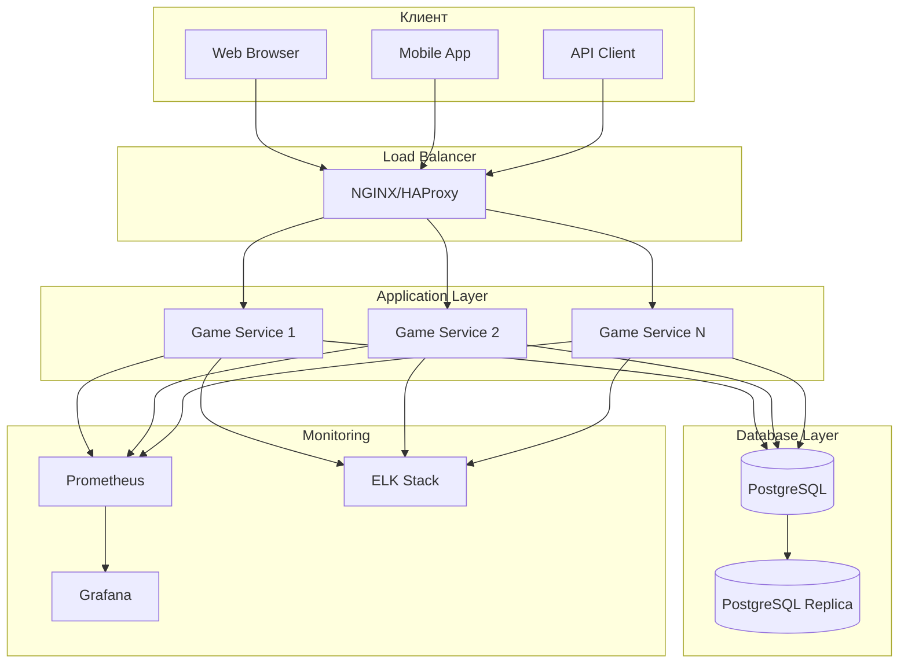
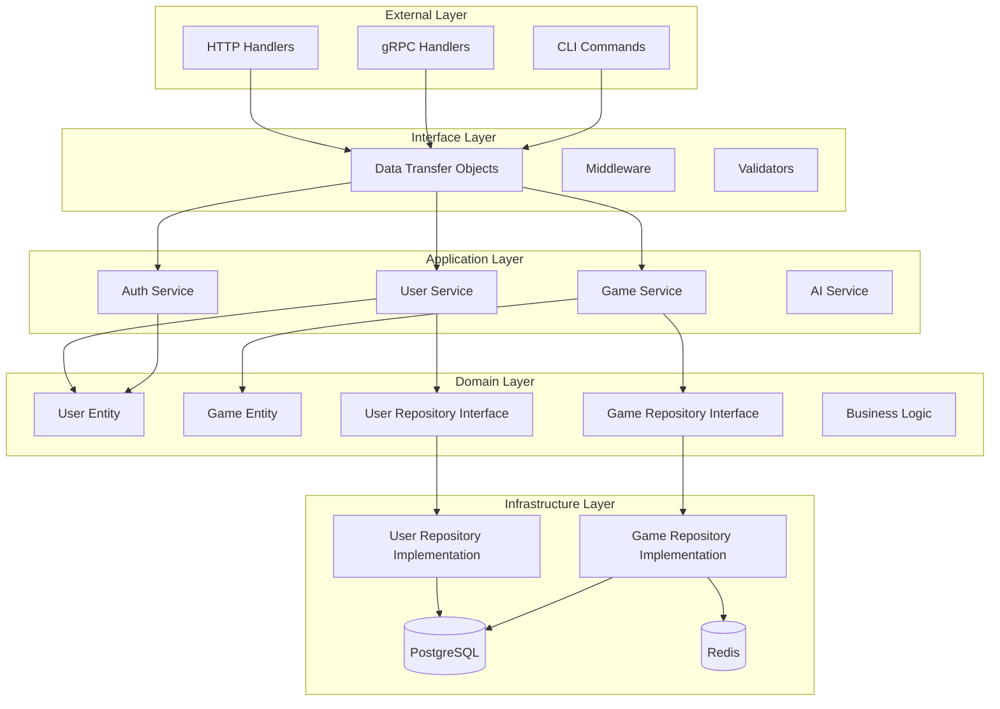
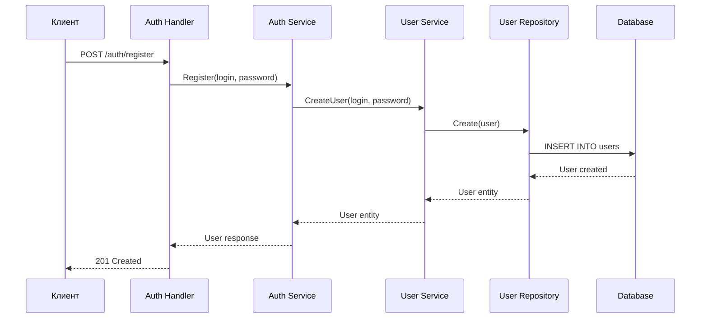
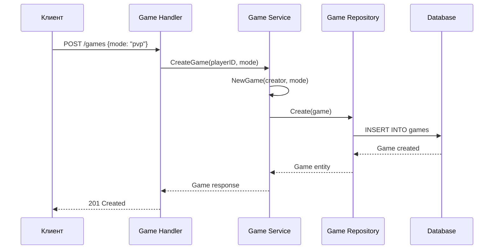
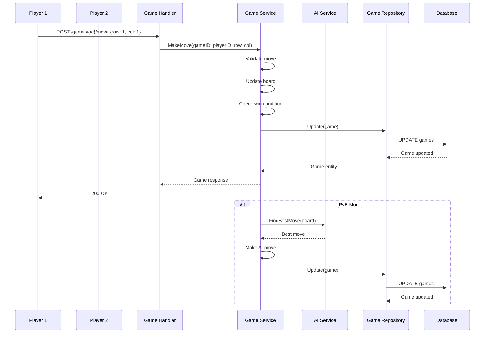
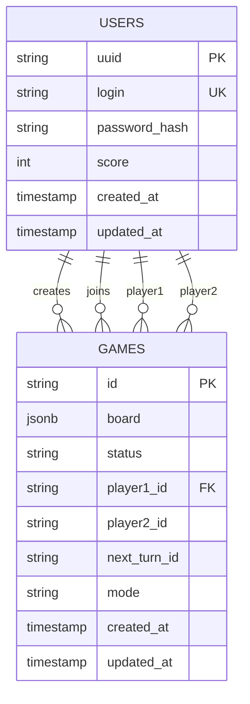
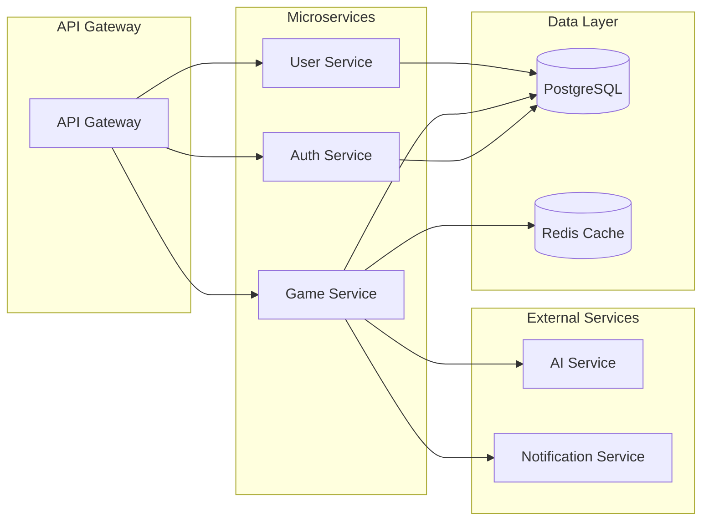
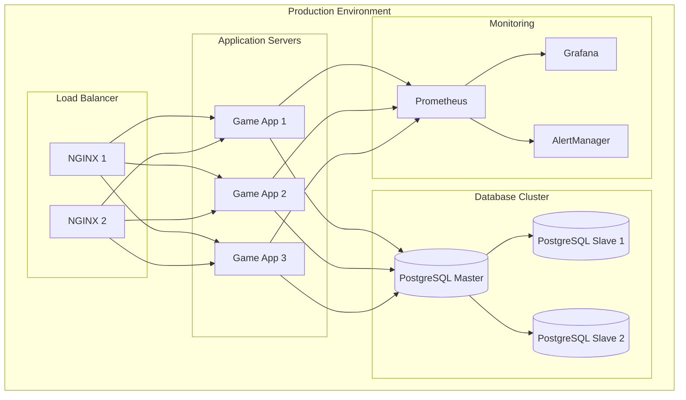
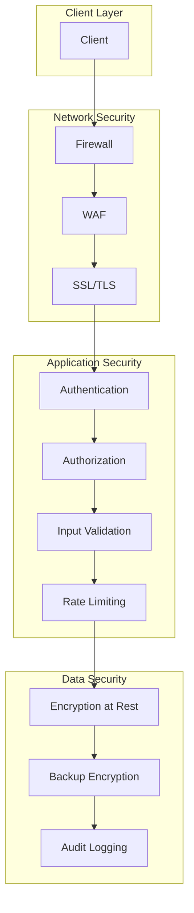
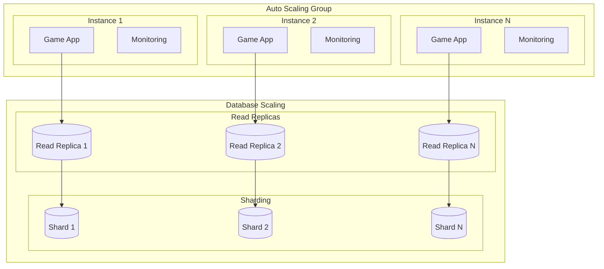

# Схемы архитектуры проекта "Крестики-Нолики"

## 1. Общая архитектура системы

## 2. Clean Architecture - Слои

## 3. Бизнес-процессы

### 3.1 Регистрация и авторизация

### 3.2 Создание игры

### 3.3 Игровой процесс

## 4. Модель данных

## 5. Компонентная архитектура

## 6. Схема развертывания

## 7. Схема безопасности

## 8. Схема масштабирования

